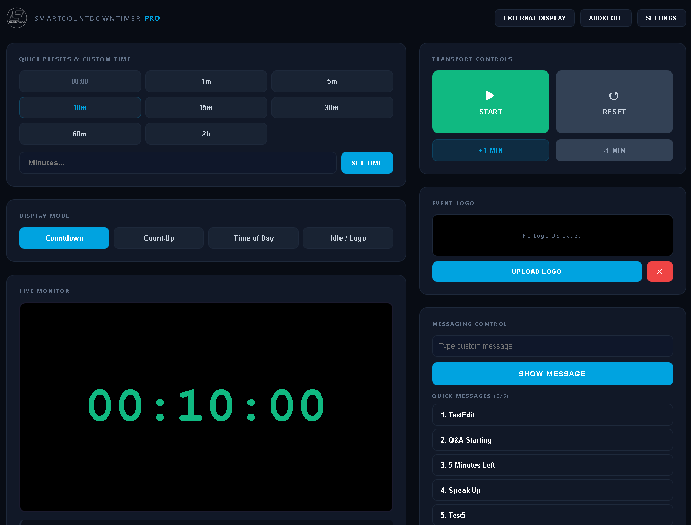

# SmartCountdownTimer Pro

Professional Stage Timer for Windows -- developed for **smartchoice**.

A full-featured countdown/count-up timer for live events, conferences, and stage productions. Built with Electron + Node.js, installable as a standalone `.exe` on Windows.



## Features

| Feature | Description |
|---|---|
| **Countdown / Count-Up** | Timer with HH:MM:SS or MM:SS display |
| **Time of Day** | Live clock display (HH:MM:SS) |
| **Idle / Logo** | Custom logo display on external screen |
| **External Display** | Fullscreen presenter window on secondary monitor/projector |
| **Fallback Window** | If no external monitor, opens resizable window |
| **Messaging** | Custom messages with instant trigger to presenter |
| **Quick Messages** | Bank of up to 5 editable messages (add, edit, delete, instant live) |
| **Audio Cues** | Upload custom sounds for timer end and warning thresholds |
| **Settings** | Customizable font family, colors (normal/warning/danger/expired), thresholds, HH/SS toggles |
| **Stop at Zero** | Auto-pause countdown at 00:00 (configurable) |
| **Bitfocus Companion** | Stream Deck integration via `/api/companion` endpoint |
| **Portable** | Single `.exe` installer -- no Node.js or Electron needed on target PC |

## Tech Stack

| Layer | Technology |
|---|---|
| Desktop Shell | Electron 28 |
| Backend | Node.js + Express |
| Real-time | Socket.IO |
| Frontend | Vanilla HTML/CSS/JS |
| Installer | electron-builder (NSIS) |

## Project Structure

```
SmartCountdownTimer-Pro/
├── main.js                  # Electron main process (window management)
├── preload.js               # IPC bridge for renderer
├── server.js                # Express + Socket.IO backend (port 3000)
├── package.json             # Dependencies & electron-builder config
├── messages.json            # Default quick messages
├── .gitignore
├── assets/
│   ├── icon.png             # App icon
│   └── icon.ico             # Installer icon
└── public/
    ├── index.html           # Moderator control panel
    ├── presenter.html       # Fullscreen presenter view
    └── images/
        └── logo.svg         # smartchoice logo
```

## API Endpoints

### Timer Control
| Method | Endpoint | Description |
|---|---|---|
| GET | `/api/start` | Start timer |
| GET | `/api/pause` | Pause timer |
| GET | `/api/toggle_playback` | Toggle start/pause |
| GET | `/api/reset?sec=N` | Reset to N seconds |
| GET | `/api/add?sec=N` | Add/subtract N seconds |
| GET | `/api/mode?set=countdown\|countup\|timeofday\|logo` | Change display mode |

### Messaging
| Method | Endpoint | Description |
|---|---|---|
| GET | `/api/message/set?text=...` | Set message text |
| GET | `/api/message/toggle` | Show/hide message |
| GET | `/api/message/trigger?index=N` | Trigger quick message (0-4) |
| GET | `/api/message/hide` | Hide message |
| GET | `/api/messages` | List quick messages |
| GET | `/api/messages/add?text=...` | Add quick message (max 5) |
| GET | `/api/messages/edit?index=N&text=...` | Edit quick message |
| GET | `/api/messages/remove?index=N` | Remove quick message |

### Settings & Audio
| Method | Endpoint | Description |
|---|---|---|
| GET | `/api/settings` | Get all settings |
| POST | `/api/settings` | Update settings (JSON body) |
| POST | `/api/audio/upload` | Upload audio `{type:"end\|warning", audio:"base64..."}` |
| GET | `/api/audio/clear?type=end\|warning` | Clear audio |
| GET | `/api/audio` | Get audio data |

### Logo
| Method | Endpoint | Description |
|---|---|---|
| POST | `/api/system/logo/upload` | Upload logo (base64 JSON) |
| GET | `/api/system/logo/clear` | Clear logo |

### Companion (Stream Deck)
| Method | Endpoint | Description |
|---|---|---|
| GET | `/api/companion` | Full state for Bitfocus Companion integration |

## Socket.IO Events

### Server → Client
| Event | Payload | Description |
|---|---|---|
| `stateUpdate` | Full state object | Timer state changes (every second) |
| `messagesUpdate` | String array | Quick messages list changed |
| `settingsUpdate` | Settings object | Settings changed |
| `audioUpdate` | `{audioEnd, audioWarning}` | Audio files updated |
| `audioTrigger` | `{type: "end"\|"warning"\|"danger"}` | Trigger audio playback |

### Client → Server
| Event | Description |
|---|---|
| `connection` | Auto-receives current state, messages, settings, audio |

## Settings Schema

```json
{
  "fontFamily": "'Courier New', monospace",
  "colorNormal": "#10b981",
  "colorWarning": "#f59e0b",
  "colorDanger": "#f97316",
  "colorExpired": "#ef4444",
  "showHours": true,
  "showSeconds": true,
  "warningThreshold": 120,
  "dangerThreshold": 30,
  "stopAtZero": true,
  "audioEndEnabled": true,
  "audioWarningEnabled": true
}
```

## Development

```powershell
# Install dependencies
npm install

# Run in dev mode (opens Electron app)
npm start

# Run server only (browser access at http://127.0.0.1:3000)
node server.js
```

## Build Installer

```powershell
npm run build
```

Output: `dist/SmartCountdownTimer Pro Setup 1.0.0.exe` (~73 MB)

The installer is standalone -- no Node.js, Electron, or any runtime required on the target PC.

## Installation

1. Run `SmartCountdownTimer Pro Setup 1.0.0.exe`
2. Follow the installer wizard
3. Launch from desktop shortcut or Start Menu

## Data Storage

User data (settings, messages, logos, audio) is stored in:
- Electron: `%APPDATA%/smartcountdowntimer-pro/`
- Standalone server: project directory

## License

UNLICENSED -- Proprietary software for smartchoice.
