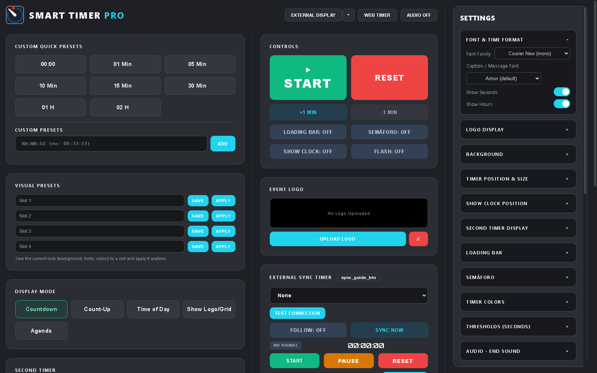
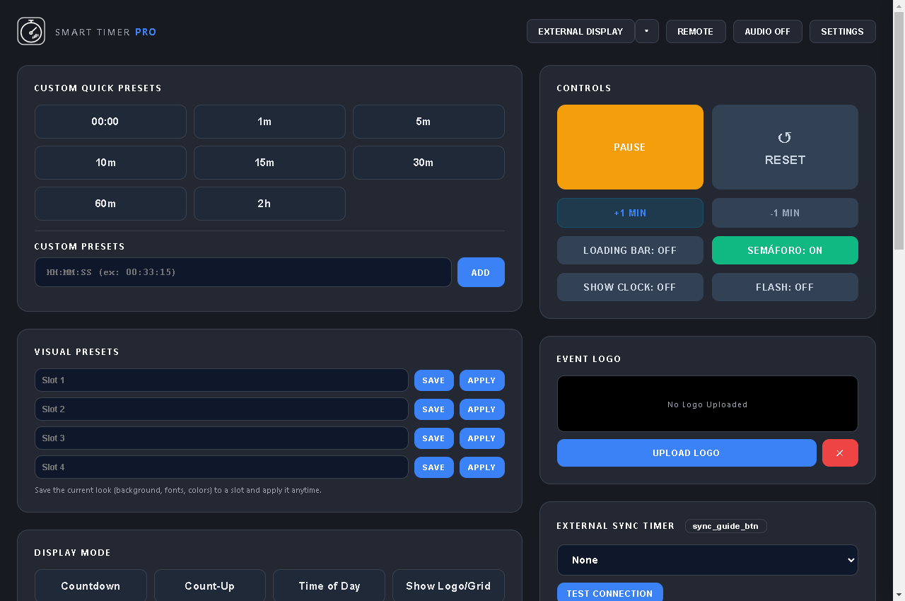
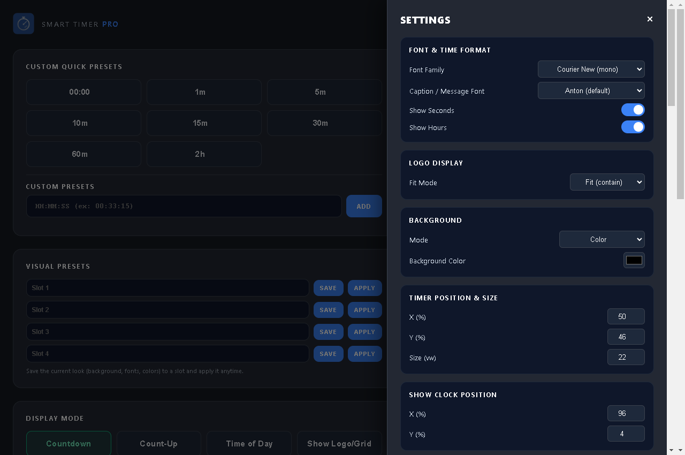
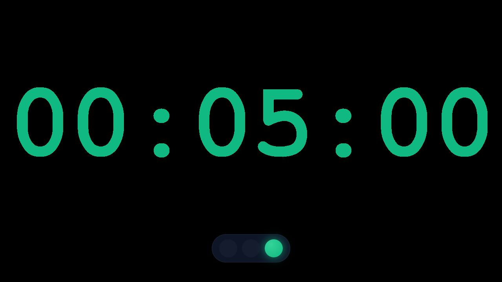
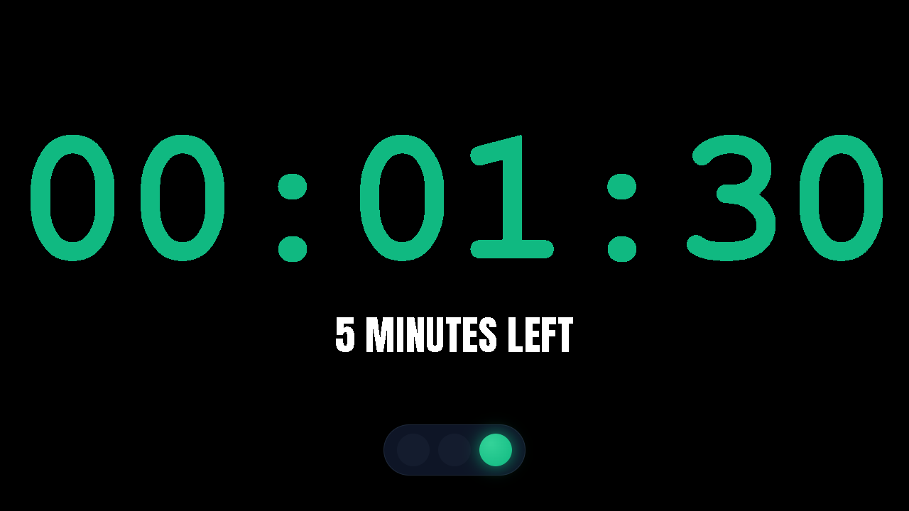
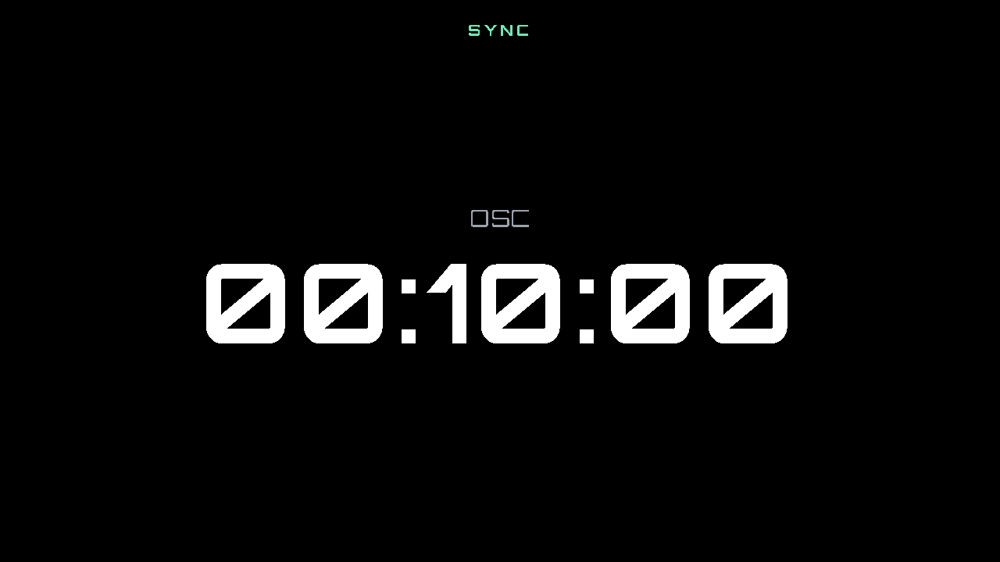
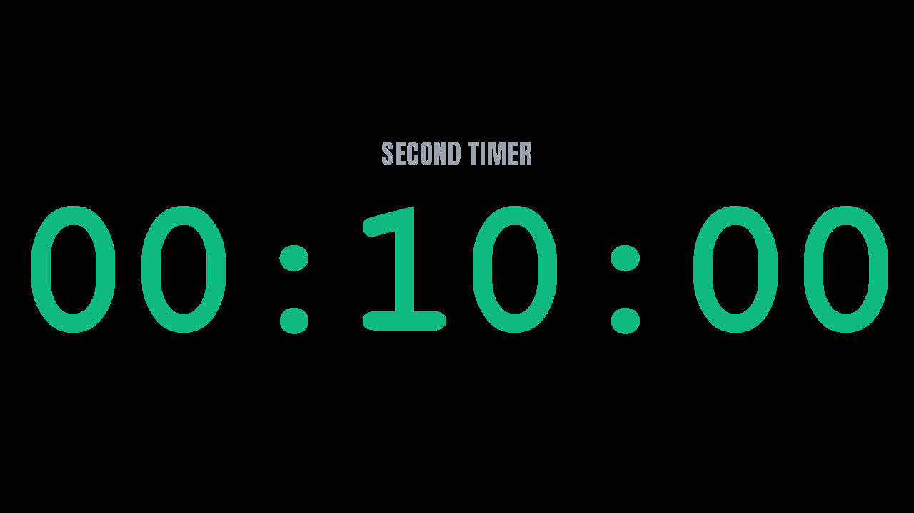
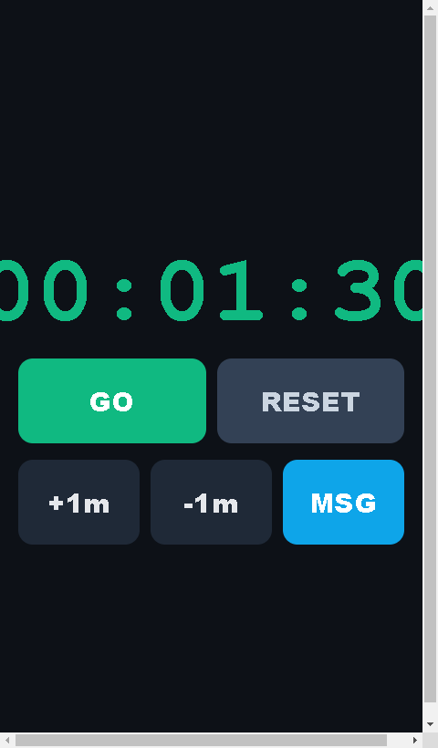
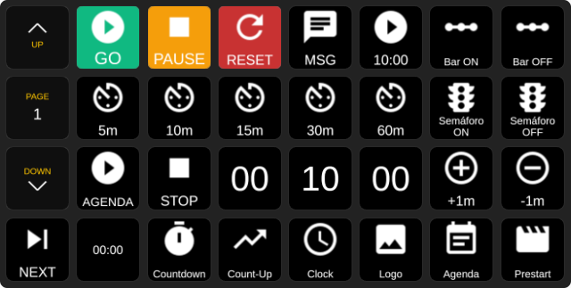

# Smart Timer Pro

Professional Stage Timer for Windows and macOS -- developed for **smartchoice**.

[](LICENSE)
[](https://github.com/sharillas/Smart-Timer-Pro/releases)
[](https://github.com/sharillas/Smart-Timer-Pro)
[](https://github.com/sharillas/Smart-Timer-Pro)
[](https://www.electronjs.org/)
[](https://nodejs.org/)
[](https://socket.io/)
[](https://github.com/sharillas/Smart-Timer-Pro/tree/master/companion/smart-timer-pro)

A full-featured countdown/count-up timer for live events, conferences, and stage productions. Built with Electron + Node.js, installable as a standalone app on Windows and macOS.

## Screenshots

### GUI - Controller
Main control panel: transport (START/PAUSE/RESET), presets, agenda, messaging, second timer and external sync timer cards, live monitor preview, and the always-open settings column on the right.



### GUI - Agenda Live
Agenda/rundown running: session timeline, "now playing" card, live message badge and Semáforo on.



### Settings Column
Always-open settings column: collapsible groups (accordion), timers display options (colors, background, position, size), security, webhook/OSC and updates — changes apply with APPLY.



### Presenter - Countdown
External display in countdown mode.



### Presenter - Warning + Semáforo + Message
Warning color, live message and the Semáforo indicator on the external display.



### External Sync Timer Display
Second presenter window that follows the remaining time of a cue running in Resolume Arena, Pixera or WATCHOUT (timecode font, SYNC badge).



### Second Timer Display
Independent second timer running on its own display output (countdown / count-up / time of day).



### Web Timer (phone/tablet)
Lightweight remote page at `/remote.html` with START/PAUSE, RESET, +1m/-1m and message toggle.



### Companion Module - Preset Buttons
Stream Deck presets via Bitfocus Companion (HH:MM:SS display, START/PAUSE, agenda controls, external sync HH:MM:SS:MS).



> Screenshots can be regenerated with `npx electron scripts/capture-screenshots.js` (starts a temporary server with demo data and captures all pages).

## Features

| Feature | Description |
|---|---|
| **Countdown / Count-Up** | Timer with HH:MM:SS or MM:SS display |
| **Second Timer** | Independent second timer (countdown / count-up / time of day) running simultaneously on its own display output or window, with its own colors, background, position and size |
| **Time of Day** | Live clock display (HH:MM:SS) |
| **Idle / Logo** | Custom logo display on external screen |
| **External Display** | Fullscreen presenter window on secondary monitor/projector (primary display never used) |
| **Fallback Window** | If no external monitor, opens resizable window |
| **Resizable Columns** | Drag the subtle dividers to resize the three interface columns (persisted between sessions) |
| **Settings Column** | Always-open settings column with accordion groups and an APPLY button (changes take effect on apply) |
| **Graphite Skin** | Clean professional dark graphite theme (built-in, no picker) |
| **Show Clock** | Clock overlay on the presenter with configurable position (X/Y %) |
| **Messaging** | Custom messages with instant trigger to presenter |
| **Quick Messages** | Bank of up to 5 editable messages (add, edit, delete, instant live) |
| **Audio Cues** | Upload custom sounds for timer end and warning thresholds |
| **Preset Badges** | Auto-formatted time badges ("01 Min", "10 Min", "02 H", "45 Seg") |
| **Stop at Zero** | Auto-pause countdown at 00:00 (configurable) |
| **Expired Flash** | Flash on expiry (3x/6x/8x/infinite) + manual FLASH button |
| **Visual Presets** | 4 slots to save/apply the current look (background, fonts, colors, timer size) |
| **External Sync Timer** | Second timer that follows the remaining time of a cue in **Resolume Arena** (REST), **Pixera** (TCP API) or **WATCHOUT** (HTTP/OSC) — shown on its own display with timecode font, SYNC/NO SIGNAL badge and TEST CONNECTION diagnostics |
| **Bitfocus Companion** | Stream Deck integration via `/api/companion` endpoint, including External Sync actions and HH:MM:SS:MS presets |
| **Agenda / Rundown** | Session list with per-session countdown, auto-advance and visual timeline |
| **Session Log** | Records all timer events; CSV export for reporting |
| **Event Profiles** | Export/import full event setup (settings, messages, presets, agenda, logo) |
| **Access PIN** | Optional PIN to protect remote control (displays stay open) |
| **OBS Integration** | Browser source with transparent overlay mode (see `docs/OBS.md`) |
| **OSC Output** | Send timer events to lighting consoles (GrandMA, ETC, ...) |
| **Webhooks** | HTTP callbacks on timer events (vMix, automation, ...) |
| **Web Timer** | Lightweight resizable window at `/remote.html` for phone/tablet control |
| **Multi-language** | English / Português |
| **Undo** | Ctrl+Z reverts the last action |
| **Keyboard Shortcuts** | Space = GO/PAUSE, R = RESET, M = message toggle (configurable) |
| **System Tray** | Close to tray with quick controls; timer keeps running |
| **Updates** | Manual update check via Settings > Updates (no automatic checks) |
| **Windows + macOS** | Standalone installer on Windows (`.exe`) and macOS (`.dmg`/`.zip`, Intel + Apple Silicon) -- no Node.js or Electron needed on the target machine |

## Tech Stack

| Layer | Technology |
|---|---|
| Desktop Shell | Electron 28 |
| Backend | Node.js + Express |
| Real-time | Socket.IO |
| Frontend | Vanilla HTML/CSS/JS |
| Installer | electron-builder (NSIS on Windows, DMG/ZIP on macOS) |

## Project Structure

```
Smart-Timer-Pro/
├── main.js                  # Electron main process (window management, tray, updates)
├── preload.js               # IPC bridge for renderer
├── server.js                # Express + Socket.IO backend (port 3000)
├── package.json             # Dependencies & electron-builder config
├── .gitignore
├── assets/
│   ├── icon.svg             # Vector icon source
│   ├── icon-white.svg       # Vector icon source (white, in-app header)
│   ├── icon.png             # App window / tray icon
│   ├── icon.ico             # Windows installer / exe / shortcuts icon
│   ├── icon.icns            # macOS app icon
│   └── screenshot_*.png     # README screenshots
├── scripts/
│   ├── make-icon.js         # Generates icon.png / icon.ico / icon.icns / logo.png / favicons (npm run icon)
│   ├── capture-screenshots.js
│   ├── build-installer.js
│   └── after-pack.js        # Patches the Windows exe icon after packaging
├── companion/
│   └── smart-timer-pro/     # Bitfocus Companion module
├── docs/                    # CHANGELOG, DEVELOPMENT, API, OBS, OPERATOR_GUIDE, SYNC_GUIDE
└── public/
    ├── index.html           # Moderator control panel
    ├── presenter.html       # Fullscreen presenter view (?view=sync / ?view=timer2)
    ├── remote.html          # Web Timer (mobile remote control)
    ├── favicon-16.png / favicon-32.png
    └── images/
        └── logo.png         # In-app header logo (white)
```

## API Endpoints

### Timer Control
| Method | Endpoint | Description |
|---|---|---|
| GET | `/api/start` | Start timer |
| GET | `/api/pause` | Pause timer |
| GET | `/api/toggle_playback` | Toggle start/pause |
| GET | `/api/reset?sec=N` | Reset to N seconds |
| GET | `/api/add?sec=N` | Add/subtract N seconds |
| GET | `/api/mode?set=countdown\|countup\|timeofday\|logo\|agenda` | Change display mode |

### Messaging
| Method | Endpoint | Description |
|---|---|---|
| GET | `/api/message/set?text=...` | Set message text |
| GET | `/api/message/toggle` | Show/hide message |
| GET | `/api/message/trigger?index=N` | Trigger quick message (0-4) |
| GET | `/api/message/hide` | Hide message |
| GET | `/api/messages` | List quick messages |
| GET | `/api/messages/add?text=...` | Add quick message (max 5) |
| GET | `/api/messages/edit?index=N&text=...` | Edit quick message |
| GET | `/api/messages/remove?index=N` | Remove quick message |

### Settings & Audio
| Method | Endpoint | Description |
|---|---|---|
| GET | `/api/settings` | Get all settings |
| POST | `/api/settings` | Update settings (JSON body) |
| POST | `/api/audio/upload` | Upload audio `{type:"end\|warning", audio:"base64..."}` |
| GET | `/api/audio/clear?type=end\|warning` | Clear audio |
| GET | `/api/audio` | Get audio data |

### Logo
| Method | Endpoint | Description |
|---|---|---|
| POST | `/api/system/logo/upload` | Upload logo (base64 JSON) |
| GET | `/api/system/logo/clear` | Clear logo |

### Companion (Stream Deck)
| Method | Endpoint | Description |
|---|---|---|
| GET | `/api/companion` | Full state for Bitfocus Companion integration (incl. external sync timer) |

### External Sync Timer
| Method | Endpoint | Description |
|---|---|---|
| GET | `/api/sync/state` | Sync timer state + provider config |
| GET | `/api/sync/test` | Live connection test to the configured provider (diagnostics) |
| GET | `/api/sync/start` | Start the local countdown of the sync timer |
| GET | `/api/sync/pause` | Pause the sync timer |
| GET | `/api/sync/reset` | Reset the sync timer |
| GET | `/api/sync/follow?value=0\|1` | Follow ON/OFF (also accepts `mode=toggle\|on\|off`) |
| GET | `/api/sync/now` | Grab the current cue time once and count down locally |

> Providers: **Resolume Arena 7** (REST, port 8080), **Pixera** (JSON-RPC 2.0 over TCP, JSON/TCP(dl) or JSON/TCP), **Pixera/WATCHOUT (HTTP)** (generic JSON GET), **OSC** (UDP listener). Setup guide: `docs/SYNC_GUIDE.md` or the GUIDE button in the app.

### Second Timer
| Method | Endpoint | Description |
|---|---|---|
| GET | `/api/timer2/start` | Start the second timer |
| GET | `/api/timer2/pause` | Pause the second timer |
| GET | `/api/timer2/reset?sec=N` | Reset the second timer (default: last set time) |
| GET | `/api/timer2/add?sec=N` | Add/subtract N seconds |
| GET | `/api/timer2/mode?set=countdown\|countup\|timeofday` | Change second timer mode |

## Socket.IO Events

### Server → Client
| Event | Payload | Description |
|---|---|---|
| `stateUpdate` | Full state object | Timer state changes (every second) |
| `messagesUpdate` | String array | Quick messages list changed |
| `settingsUpdate` | Settings object | Settings changed |
| `audioUpdate` | `{audioEnd, audioWarning}` | Audio files updated |
| `audioTrigger` | `{type: "end"\|"warning"\|"danger"}` | Trigger audio playback |

### Client → Server
| Event | Description |
|---|---|
| `connection` | Auto-receives current state, messages, settings, audio |

## Settings Schema

```json
{
  "fontFamily": "'Courier New', monospace",
  "colorNormal": "#10b981",
  "colorWarning": "#f59e0b",
  "colorDanger": "#f97316",
  "colorExpired": "#ef4444",
  "showHours": true,
  "showSeconds": true,
  "warningThreshold": 120,
  "dangerThreshold": 30,
  "stopAtZero": true,
  "audioEndEnabled": true,
  "audioWarningEnabled": true,
  "showClock": false,
  "clockX": 96,
  "clockY": 4,
  "syncProvider": "none",
  "syncHost": "",
  "syncPixeraPort": 4023,
  "syncPixeraTimeline": "Timeline 1",
  "syncOscPort": 9001
}
```

The installer is standalone -- no Node.js, Electron, or any runtime required on the target PC.

## Installation

### Windows
1. Run `Smart Timer Pro Setup 3.0.0.exe`
2. Follow the installer wizard
3. Launch from desktop shortcut or Start Menu

### macOS
1. Open the `.dmg` (Intel or Apple Silicon) and drag Smart Timer Pro to Applications
2. First launch: right-click → Open (Gatekeeper, unsigned build)

## Data Storage

User data (settings, messages, logos, audio) is stored in:
- Electron: `%APPDATA%/smart-timer-pro/` (Windows) / `~/Library/Application Support/smart-timer-pro/` (macOS)
- Standalone server: project directory

## License

Este projeto é de **software proprietário** — `Copyright © 2026 Nelson Teixeira`. Todos os direitos reservados.

Desenvolvido por **Nelson Teixeira** para a **smartchoice**. Consulte o ficheiro [LICENSE](LICENSE) para os termos completos de utilização.
